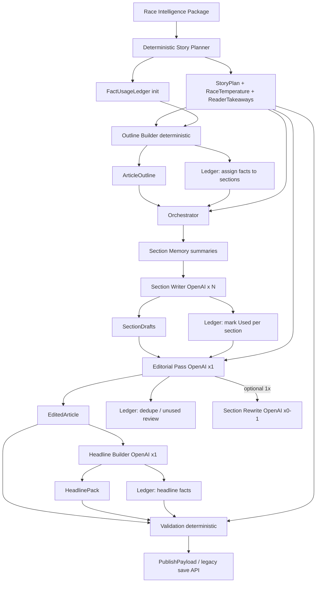

# Phase 3 — Multi-Pass Miles Apex Writer (Frozen Design)

**Status:** Approved and frozen. Architecture changes require explicit product approval.  
**Implementation:** Phase 3a begins with deterministic planner, ledger, outline, and preview only — **no multi-pass OpenAI writer yet.**

---

## Architecture (frozen)



**OpenAI (production only):** Section Writer, Editorial Pass (+ bounded rewrite), Headline Builder.  
**Never OpenAI:** Story Planner (including temperature and takeaways), Outline, Ledger, Memory, Validation.

---

## StoryPlan schema (updated)

```typescript
StoryPlan {
  operationId: string
  seasonId: string
  raceNumber: number
  articleType: string
  articleDepth: 'short' | 'medium' | 'in-depth'
  packageFingerprint: string
  plannerVersion: string
  generatedAt: ISO8601

  stories: StoryAssignment[]

  raceTemperature: RaceTemperature

  readerTakeaways: ReaderTakeaway[]

  rankedDrivers: {
    driverId: string
    roles: string[]
    priority: number
    factIds: string[]
    storyImportanceScore: number
  }[]

  leadStoryId: string

  plannerDiagnostics: {
    candidateCount: number
    suppressedStories: { storyId: string; reason: string }[]
    tieBreakers: string[]
  }
}

StoryAssignment {
  storyId: string
  category: StoryCategory
  priority: number
  importanceScore: number
  factIds: string[]
  canonicalFactIds: string[]
  driverIds: string[]
  confidence: string
  empty: boolean
}

StoryCategory =
  | 'lead_story'
  | 'secondary_story'
  | 'championship_story'
  | 'human_story'
  | 'technical_story'
  | 'feature_story'
  | 'hidden_story'
  | 'momentum_story'
  | 'strategy_story'
  | 'controversy_story'
```

Additional deterministic tags on plan (via stories or rankedDrivers): `biggest_winner`, `biggest_loser`, `best_recovery` — same `StoryAssignment` shape.

---

## RaceTemperature schema

Computed **only** from package evidence (timeline, events, championship movement, strategy, cautions, incidents, canonical facts, confidence, importance). **No prose. No OpenAI.**

```typescript
RaceTemperatureTag =
  | 'routine'
  | 'competitive'
  | 'chaotic'
  | 'historic'
  | 'championship_defining'
  | 'emotional'
  | 'controversial'
  | 'technical'
  | 'fuel_mileage'
  | 'rain_affected'

RaceTemperature {
  primary: RaceTemperatureTag
  secondary: RaceTemperatureTag | null
  confidence: number              // 0–100, deterministic score from signal strength
  supportingFactIds: string[]
  canonicalFactIds: string[]
  signals: {                      // audit trail for planner/debug
    tag: RaceTemperatureTag
    score: number
    factIds: string[]
    reason: string                 // e.g. "caution_count_high", "title_points_swing"
  }[]
}
```

**Deterministic selection (conceptual):**

- Score each tag from weighted signals (caution density, incident count, title points delta, conflicting facts, strategy fact density, weather/rain facts if present, historic milestone facts, etc.).
- `primary` = highest score; `secondary` = next if within threshold of primary.
- `confidence` = normalized margin between primary and runner-up (capped 0–100).

**Downstream use (writing stages only):** headline energy, lede tone, section emphasis, pacing — via style briefs, not planner prose.

---

## ReaderTakeaways schema

Deterministic editorial goals derived from `StoryAssignment`s and canonical facts. **Not sentences. Not summaries. Not LLM text.**

```typescript
ReaderTakeaway {
  takeawayId: string              // stable slug, e.g. "championship_tightened"
  label: string                   // short newsroom label (template-filled from facts/drivers, max ~8 words)
  priority: number                // 1 = must appear in final article
  importanceScore: number
  factIds: string[]
  canonicalFactIds: string[]
  sourceStoryIds: string[]        // links to StoryAssignment.storyId
  category: 'championship' | 'strategy' | 'incident' | 'human' | 'momentum' | 'penalty' | 'result' | 'other'
}
```

**Generation (deterministic):**

- Map each non-empty high-priority story to 0–1 takeaway templates (e.g. championship_story → "Championship battle tightened" when delta facts match rules).
- Merge duplicates; cap count by depth (short 2–3, medium 4–6, in-depth 6–10).
- `label` uses driver names / factual tokens from linked facts only (string templates), never generative paraphrase.

Example array (illustrative):

```json
"readerTakeaways": [
  { "takeawayId": "championship_tightened", "label": "Championship tightened", "priority": 1, "factIds": ["..."], "importanceScore": 88 },
  { "takeawayId": "fuel_mileage_decisive", "label": "Fuel mileage mattered", "priority": 2, "factIds": ["..."], "importanceScore": 72 }
]
```

---

## FactUsageLedger (unchanged role)

Persists through planner → outline → section writer → editor → headline → validation.  
Cache invalidation: if evidence changes, regenerate only affected sections (not full article).

Takeaways and temperature tags register on ledger as **plan metadata**; takeaway `factIds` must appear in ledger with at least `planned` status when assigned to sections.

---

## Section memory (unchanged)

Section writers receive: current section brief, section evidence slice, compact **SectionMemory** (bullets + factIds from prior sections — not full text).

---

## Editor responsibilities (updated)

All prior duties remain: merge, flow, transitions, dedupe, Miles Apex voice, lead emphasis, story progression, optional **one** bounded section rewrite.

**Added:**

- **Reader Takeaways coverage:** Every takeaway with `priority <= depthThreshold` must be reflected in the edited body (entity/theme match against `label` + linked factIds).
- If a **high-priority takeaway** (priority 1, or priority 2 at in-depth) is missing → emit `rewriteRequest` for the most relevant section (same bounded single rewrite as missing major story).

**Rubric (unchanged):** Why mattered, why care, what changed, what next — without inventing facts.

---

## Validation pipeline (updated)

Deterministic checks (may trigger bounded regen via editor rewrite request):

| Check | Rule |
|--------|------|
| Lead story represented | `leadStoryId` themes/drivers/facts present in body |
| **Reader takeaways represented** | Each takeaway with priority ≤ threshold appears (label tokens + fact trace) |
| Headline matches lead story | Entity/theme match |
| **Headline reflects race temperature** | Style rules per `primary` tag (e.g. chaotic → urgency tokens allowed; routine → no hype patterns) |
| Critical facts used | Ledger coverage % for critical/high tiers |
| No duplicate major stories | Ledger + narrative dedupe |
| Miles Apex voice | Existing blocklist/heuristics |
| Fact traceability | Claims map to factIds |
| Word count | `ARTICLE_DEPTH_WORD_RANGES` |

---

## Article style influence (Race Temperature)

Applied **only** in Section Writer, Editorial Pass, and Headline Builder prompts as structured **style brief** (not free prose from planner):

| Temperature | Headline energy | Lede | Transitions | Conclusion |
|---------------|-----------------|------|-------------|------------|
| routine | calm, factual | straight recap | efficient | brief look-ahead |
| competitive | moderate punch | battle framing | turn-by-turn | winner + challenger |
| chaotic | higher urgency | incident-aware lede | shorter paragraphs | what mattered most |
| historic | significance weight | context lede | milestone callbacks | legacy/record note |
| championship_defining | season stakes | points narrative | championship through-line | standings emphasis |
| emotional | human angle | driver beat | story-led | human note |
| controversial | careful, precise | dispute facts only | neutral tone | what is verified |
| technical / fuel_mileage | analytical | strategy hook | cause-effect | strategy summary |
| rain_affected | conditions-first | weather/setup | condition callbacks | track/state note |

Planner outputs tags only; orchestrator passes `raceTemperature` + `readerTakeaways` into each writing stage’s brief.

---

## OpenAI call estimates (unchanged)

| Depth | Approx. calls |
|--------|----------------|
| Short | 5–7 |
| Medium | 7–10 |
| In-depth | 10–16 |

Planner (including temperature + takeaways): **0 calls.**

---

## Phase 3a implementation scope (unchanged)

1. Deterministic `buildStoryPlan()` including **RaceTemperature** and **ReaderTakeaways**
2. `FactUsageLedger` init and planner/outline updates
3. Deterministic `buildArticleOutline()`
4. Preview API returns plan + ledger snapshot
5. Unit tests, fixture package, **zero OpenAI**
6. **No** changes to `generateNewsArticle`, prompts, or multi-pass writer

---

## Migration / flags (unchanged)

- `NEWS_MULTI_PASS_WRITER_ENABLED` (default false until later phases)
- Research architecture frozen unless bugfix

---

*Document version: 3.0 (frozen). Last refinement: Race Temperature + Reader Takeaways.*
